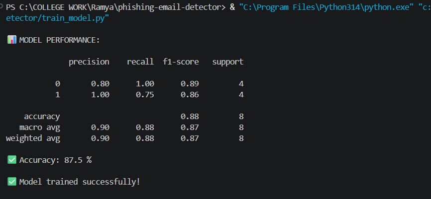
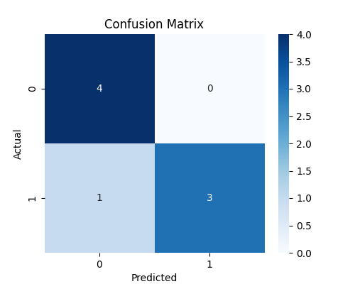
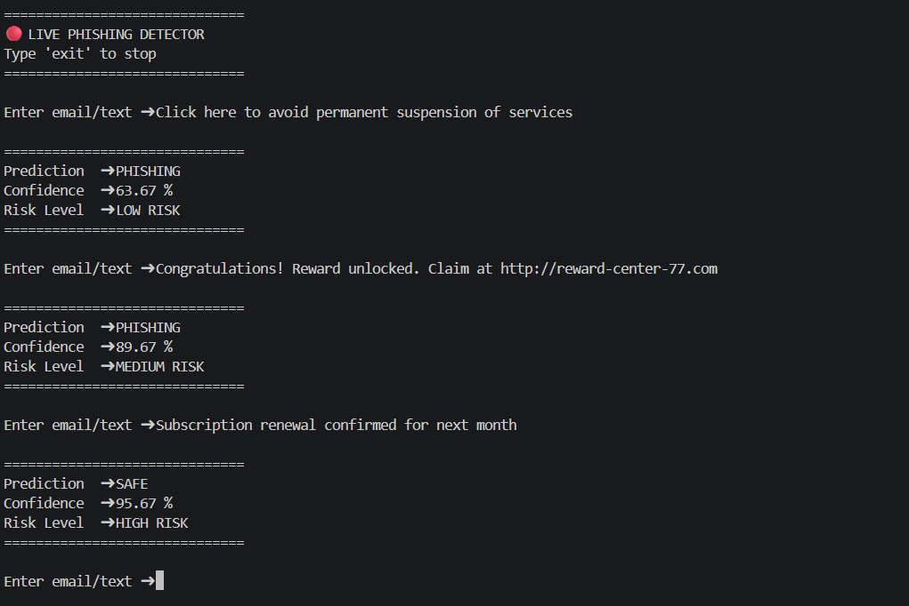

# Phishing Email Detection using Machine Learning

## 📌 Project Overview

This project is a Machine Learning based phishing email detection system developed using Python and Scikit-learn.

The model analyzes email text content and classifies emails as:

- ✅ SAFE
- ⚠️ PHISHING

The system uses:
- TF-IDF Vectorization
- Random Forest Classifier
- Confusion Matrix Evaluation
- Live Real-Time Detection

This project was developed as part of a Cybersecurity Internship project.

---

# 🚀 Features

- Detects phishing emails using Machine Learning
- TF-IDF text vectorization
- Random Forest classification
- Real-time phishing detection
- Accuracy evaluation
- Confusion matrix visualization
- Confidence score prediction
- Risk level analysis
- Model saving using Joblib

---

# 🛠 Technologies Used

- Python
- Pandas
- Scikit-learn
- Matplotlib
- Seaborn
- Joblib

---

# 📂 Project Structure

```text
Phishing-Email-Detection/
│
├── dataset/
│   └── phishing_emails.csv
│
├── models/
│   ├── phishing_model.pkl
│   └── vectorizer.pkl
│
├── screenshots/
│   ├── confusion_matrix.png
│   ├── live_detection.png
│   └── accuracy.png
│
├── train_model.py
├── requirements.txt
├── README.md
└── .gitignore
```

---

# 📊 Machine Learning Workflow

```text
Dataset
   ↓
TF-IDF Vectorization
   ↓
Train/Test Split
   ↓
Random Forest Training
   ↓
Prediction
   ↓
Accuracy & Confusion Matrix
   ↓
Live Detection
```

---

# 📁 Dataset

The dataset contains:
- Phishing Emails
- Safe Emails

Dataset format:

| label | text |
|------|------|
| phishing | URGENT: Verify your account immediately |
| safe | Meeting scheduled tomorrow |

---

# ⚙️ Installation

## 1️⃣ Clone Repository

```bash
git clone <your-github-repo-link>
```

---

## 2️⃣ Install Requirements

```bash
pip install -r requirements.txt
```

---

# ▶️ Run Project

```bash
python train_model.py
```

---

# 📊 Model Accuracy



Example output:

```text
📊 MODEL PERFORMANCE:

              precision    recall  f1-score   support

           0       0.80      1.00      0.89         4
           1       1.00      0.75      0.86         4

    accuracy                           0.88         8

✅ Accuracy: 87.5 %
```

---

# 📈 Confusion Matrix



Confusion matrix generated after testing:

```text
[[4 0]
 [1 3]]
```

Meaning:
- 4 Safe emails correctly detected
- 3 Phishing emails correctly detected
- 1 phishing email missed

---

# 🔴 Live Detection



## Example 1 — Phishing Email

Input:

```text
URGENT: Verify your bank account immediately at http://secure-login.com
```

Output:

```text
==============================
Prediction  ➜ PHISHING
Confidence  ➜ 96.45 %
Risk Level  ➜ HIGH RISK
==============================
```

---

## Example 2 — Safe Email

Input:

```text
Meeting scheduled tomorrow at 10 AM.
```

Output:

```text
==============================
Prediction  ➜ SAFE
Confidence  ➜ 91.32 %
Risk Level  ➜ HIGH RISK
==============================
```

---

# 💾 Model Saving

After training:

```text
✅ Model trained successfully!
```

Generated files:

```text
models/phishing_model.pkl
models/vectorizer.pkl
```

---

# 🎯 Future Improvements

- Streamlit Web Application
- URL Reputation Analysis
- Email Header Analysis
- Explainable AI
- Deep Learning Models
- Larger Dataset Integration

---

# 🔐 Cybersecurity Importance

Phishing attacks are one of the most common cyber threats used to steal:
- passwords
- banking credentials
- personal information

This project helps identify suspicious emails automatically using Machine Learning techniques.

---

# 👨‍💻 Author

Developed by:
Galizerugulla Thirumala Ramyashri
